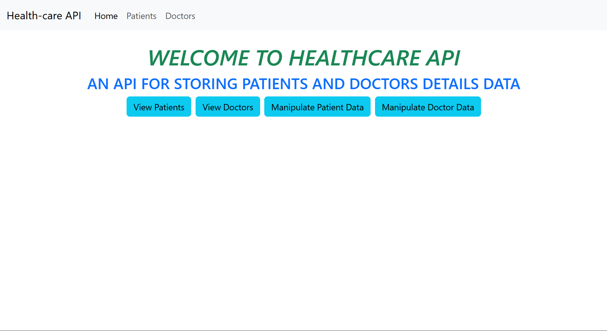
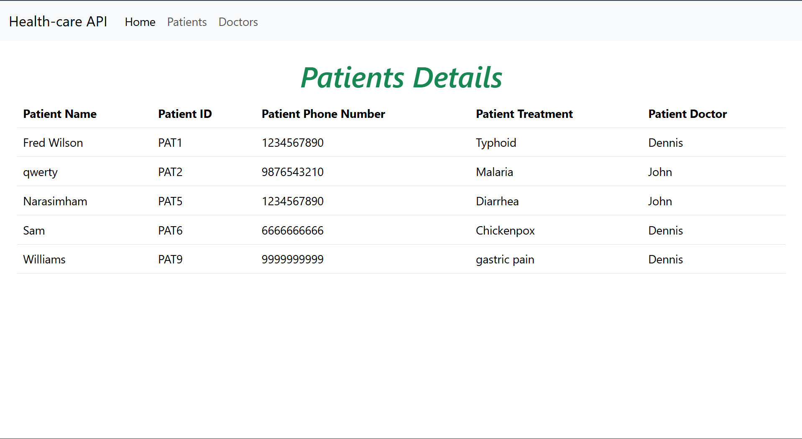
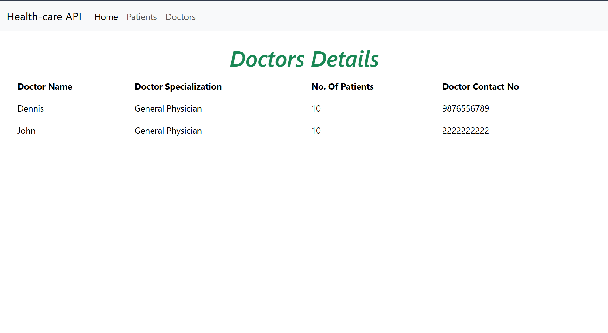

# Healthcare API Project

## Overview
Healthcare API Project is a Django and Django REST Framework based web application developed to manage healthcare-related data through RESTful APIs and web pages. The project includes functionalities for handling patient and doctor information, rendering HTML templates for displaying records, and managing data using Django models and serializers.

The application provides API endpoints along with frontend template rendering for viewing patient and doctor details. It follows Django’s MVT (Model-View-Template) architecture and uses Django REST Framework for API development.

This project was fully designed and developed individually.

---

# Tech Stack

- Python
- Django
- Django REST Framework (DRF)
- SQLite3
- HTML5
- Bootstrap (Template Styling)
- Django Template Engine

---

# Features

- REST API development using Django REST Framework.
- Patient data management.
- Doctor data management.
- API serialization using DRF serializers.
- Dynamic template rendering using Django templates.
- Homepage with navigation support.
- Separate pages for doctor and patient details.
- Database integration using SQLite.
- Django admin configuration support.
- URL routing and API endpoint management.

---

# Role

Responsibilities:
1. Developed the complete Healthcare API Project individually using Django and Django REST Framework.
2. Created database models for managing patient and doctor information.
3. Implemented REST API serializers for handling JSON data conversion.
4. Developed views and URL routing for API endpoints and web pages.
5. Designed HTML templates for displaying healthcare-related data.
6. Integrated SQLite database for backend data storage.
7. Configured Django project settings and application modules.
8. Implemented template inheritance and navigation components.
9. Performed testing, debugging, and project maintenance.
10. Managed the complete project structure, deployment preparation, and support.

---

# Project Structure

```text
healthcare_api_project/
│
├── manage.py
├── requirements.txt
├── db.sqlite3
│
├── healthcare_api_project/
│   ├── settings.py
│   ├── urls.py
│   ├── asgi.py
│   └── wsgi.py
│
├── healthcare_api_app/
│   ├── admin.py
│   ├── apps.py
│   ├── models.py
│   ├── serializers.py
│   ├── tests.py
│   ├── views.py
│   └── migrations/
│
└── templates/
    └── healthcare_api_app/
        ├── homepage.html
        ├── navbar.html
        ├── doctors_details.html
        └── patients_details.html
```

---

# Installation

## Clone the Repository

```bash
git clone <repository_url>
cd healthcare_api_project
```

## Create Virtual Environment

```bash
python -m venv venv
```

## Activate Virtual Environment

### Windows

```bash
venv\Scripts\activate
```

### macOS/Linux

```bash
source venv/bin/activate
```

## Install Dependencies

```bash
pip install -r requirements.txt
```

## Run Database Migrations

```bash
python manage.py migrate
```

## Start Development Server

```bash
python manage.py runserver
```

---

# API and Web Pages

The project includes:

- Homepage
- Doctor Details Page
- Patient Details Page
- API endpoints for healthcare data handling

---

# Screenshots of Some Web pages from the web application








---

# Conclusion

Healthcare API Project demonstrates backend API development using Django REST Framework along with frontend template integration using Django templates. The project focuses on healthcare data handling, API creation, database management, and web application development using Django.

